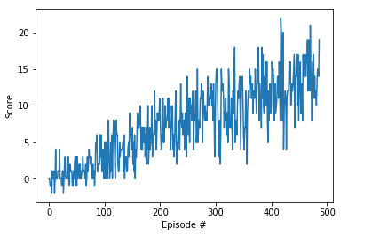

# Report: Project 1 - Navigation

## Introduction 

In this report we present a Deep Reinforcement Learning (RL) agent solving a variation of the [Unity Banana Collector](https://github.com/Unity-Technologies/ml-agents/blob/master/docs/Learning-Environment-Examples.md#banana-collector) task. In this task, an agent must navigate a planar environment, collecting yellow bananas whilst
avoiding blue bananas.

The agent is coded in Python using the Torch RL framework, and the code is contained in the same directory
as this report. To run it, follow the instructions in [README.md](https://github.com/srmorgan1/deep-reinforcement-learning/blob/master/p1_navigation/README.md)

## Solution

The agent was created by adapting the Deep Q-Learning neural network from the [Lunar lander](https://github.com/udacity/deep-reinforcement-learning/tree/master/dqn/solution) task.
The adaptation involves changing the main agent training code to use the Unity ML-agent toolkit instead
of the Open AI gym environment. The solution was developed in the online Udacity code environment
without being able to visualise the agent training, as the Unity environment did not work on my Mac due to a
Unity timeout exception.

### Deep Neural Network

The Deep Q-Learning algorithm represents the optimal action-value function as a neural network instead of a table. The neural network we used is a feed-forward network consisting of the four layers below:

+ A linear input layer with the number of neurons equal to the size of the environment state. The state size
  has 37 dimensions, consisting of a ray-based perception of objects in the agent's forward direction along
  with the agent's velocity.
+ Two hidden layers using the rectified linear activation function, of arbitrary sizes 128 and 64 neurons.
+ A linear output layer with the number of neurons equal to the size of the agent's action space. The size of
  the action space is 4 as the possible actions are walking forwards or backwards, turning left or turning
  right.

### Learning Algorithm

THE Deep Q Network (DQN) learning algorithm used to solve the yellow banana collection task uses the deep
neural network described above along with the following features:

+ Fixed-Q targets: Instead of a single deep neural network (DNN), we use two identical DNNs, the primary and target networks.
  Two networks are used because in the temporal difference error calculation the target function changes constantly, creating harmful
  correlations and leading to unstable learning. During training, we fix the weights of the target network and replace them with the
  primary network's weights every N steps. Without fixed Q-targets in the target network we would encounter a harmful form of correlation
  whereby the parameters of the network are modified based on a constantly moving target.
+ Experience Replay: When an agent interacts with the environment, the sequence of experiences can be highly correlated.
  The naive Q-learning algorithm that learns from each of these experience tuples in sequential order runs the risk of being influenced by the effects of this correlation. To address this issue the DQN algorithm uses a technique called experience replay. This works by storing
  a buffer of sequential experiences with the environment and then sampling those experiences from the buffer at random thus avoiding
  correlation and subsequent diverging of action values.

## DQN Hyper-Parameters

The hyper-parameters from the DQN Lunar lander lesson were used without changes:

+ Decay factor (gamma) 0.99
+ The network was trained using a batch size of 64 samples
+ Learning rate 0.0005
+ Epsilon starting value of 1, epsilon decay of 0.995, and the minimum possible epsilon value was set to 0.01.

The target network was updated every four steps.

## Results

The DQN algorithm was able to solve the modified banana task in around 400-500 episodes consistently (387 episodes in the results contained in Navigation.ipynb).
A plot of training reward score vs. spisode number is shown below:

## Ideas for future work

Test various improvements to the DQN algorithm to see which improves the training resuilts most, and whether
the training score improves more smoothly. This may involve using a metric for smoothness of the reward score, such as a rolling
standard deviation. The three improvements below address different issues with the original DQN algorithm.

+ Double DQN - Deep Q-Learning tends to overestimate action values. Double Q-Learning has been shown to work well in practice to help with this.
+ Prioritised Experience Replay - Deep Q-Learning samples experience transitions uniformly from a replay memory. Prioritized experienced replay is based on the idea that the agent can learn more effectively from some transitions than from others, and the more important transitions should be sampled with higher probability.
+ Dueling DQN - Currently, in order to determine which states are (or are not) valuable, we have to estimate the corresponding action values for each action. However, by replacing the traditional Deep Q-Network (DQN) architecture with a dueling architecture, we can assess the value of each state, without having to learn the effect of each action.

Finally we could test the [Rainbow Algorithm] (https://arxiv.org/abs/1710.02298) which incorporates all three of the modifications above as well as three others.